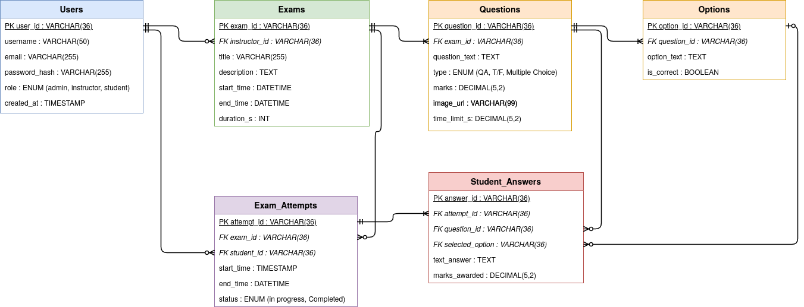

<p align="center">
  
  
  
  
  
  
</p>

# SkillCheck — Online Examination System

> A modern, full-featured online examination and assessment platform built with **Laravel 13**. Designed for instructors to author exams effortlessly, students to take assessments seamlessly, and admins to moderate everything from a single dashboard.

---

## Key Highlights

| Feature | Description |
|:---|:---|
| **Multi-Question Types** | MCQ, True/False, Short Answer, and Essay — all in one exam |
| **Auto-Grading** | Instant scoring for objective questions; manual grading for essays |
| **Question Randomization** | Shuffle question order per student to discourage cheating |
| **Per-Question Time Limits** | Individual countdown timers with automatic submission on expiry |
| **JSON Import/Export** | Portable question banks — export once, import anywhere |
| **Image Support** | Attach uploaded images or external URLs to any question |
| **Exam Locking** | Prevent edits to active exams with lock states |
| **Profile Management** | Profile pictures, username customization, and password reset |
| **Admin Moderation** | Suspend users, delete exams, and monitor platform health |
| **Glassmorphism UI** | Premium design with dynamic gradients and dark mode support |

---

## Features by Role

### Student Portal
- **Available Exams Dashboard** — Browse active exams with duration, question count, and availability at a glance.
- **Dynamic Test-Taking Interface:**
  - Single-question pagination with instant answer saving
  - Randomized question ordering support
  - Per-question countdown timers with auto-submission
  - Auto-submit on tab closure via `pagehide` beacon
- **Attempt History & Review** — View past attempts, review submitted vs. correct answers, and see marks awarded (configurable by instructor).

### Instructor Portal
- **Exam Management** — Full CRUD with customized start/end dates, durations, and visibility settings.
- **Question Bank & Customizations:**
  - Support for MCQ, True/False, Short Answer, and Essay question types
  - Drag-and-drop question reordering
  - Optional image uploads or external image URLs
  - Exam lock states to prevent editing active exams
- **Import & Export** — JSON-based question bank portability across exams.
- **Grading & Evaluation:**
  - Auto-grading for MCQ, True/False, and Short Answer
  - Dedicated manual grading interface for Essay submissions
  - Finalize grading to publish results to students
  - Delete student attempts when needed

### Admin Dashboard
- **System Metrics** — At-a-glance overview of total users, active exams, and exam attempts.
- **User Moderation** — Manage student and instructor accounts with suspend/ban toggle.
- **Content Moderation** — Monitor, manage, and delete exams platform-wide.

---

## Technology Stack

| Layer | Technologies |
|:---|:---|
| **Backend** | PHP 8.3+, Laravel 13.x |
| **Frontend** | Laravel Blade, Alpine.js 3.x |
| **Styling** | TailwindCSS v4, Bootstrap v5 |
| **Build Tool** | Vite 8.x |
| **Database** | MariaDB (default), MySQL, PostgreSQL, SQLite |
| **Auth** | Laravel built-in authentication with password reset |
| **Dev Tools** | Laravel Pail, Pint, PHPUnit 12, Faker |

---

## Architecture

SkillCheck follows the **MVC** pattern with role-based modular organization:

```
app/
├── Http/
│   ├── Controllers/
│   │   ├── AuthController.php          # Authentication & profile management
│   │   ├── Admin/
│   │   │   ├── DashboardController.php # System metrics overview
│   │   │   ├── ExamController.php      # Exam moderation
│   │   │   └── UserController.php      # User suspend/ban management
│   │   ├── Instructor/
│   │   │   ├── ExamController.php      # Exam CRUD
│   │   │   ├── QuestionController.php  # Question management & import/export
│   │   │   ├── SubmissionController.php# Grading & finalization
│   │   │   └── AnswerController.php    # Individual answer grading
│   │   └── Student/
│   │       ├── ExamController.php      # Exam browsing
│   │       ├── AttemptController.php   # Test-taking & submission
│   │       └── AnswerController.php    # Answer saving
│   └── Middleware/
│       ├── RoleMiddleware.php          # Role-based access control
│       ├── CheckSuspended.php          # Block suspended users
│       └── AutoSubmitActiveAttempts.php # Enforce time limits
├── Models/
│   ├── User.php, Exam.php, Question.php
│   ├── Option.php, ExamAttempt.php, StudentAnswer.php
└── Services/
    └── QuestionImporter.php            # JSON question import logic
```

---

## Database Design

The system uses **6 core tables** with well-defined relationships:

<p align="center">
  
</p>

| Table | Purpose |
|:---|:---|
| `users` | Admin, instructor, and student accounts with role enum |
| `exams` | Exam metadata — title, description, schedule, duration |
| `questions` | Question content — text, type, marks, image, time limit |
| `options` | Answer choices for MCQ/T-F with `is_correct` flag |
| `exam_attempts` | Student session tracking — start/end time, status |
| `student_answers` | Submitted answers — selected option, text, marks awarded |

---

## Getting Started

### Prerequisites

- **PHP** >= 8.3
- **Composer** (PHP package manager)
- **Node.js** >= 18 & **npm**
- **MariaDB** / MySQL / SQLite

### Quick Setup

```bash
# 1. Clone & enter the project
git clone https://github.com/CupNoodlez/skillcheck.git
cd skillcheck

# 2. Install dependencies
composer install
npm install

# 3. Configure environment
cp .env.example .env
php artisan key:generate

# 4. Set up database (update .env with your DB credentials first)
php artisan migrate --seed

# 5. Launch development server
composer dev
```

> **Tip:** `composer dev` starts the Laravel server, Vite compiler, queue listener, and log watcher concurrently. To run them individually:
> ```bash
> php artisan serve     # Laravel dev server
> npm run dev           # Vite asset compilation
> ```

---

## Default Test Accounts

The database seeder generates three role-based accounts for testing:

| Role | Email | Username | Password |
|:---|:---|:---|:---|
| **Admin** | `admin@skillcheck.com` | `admin` | `password` |
| **Instructor** | `instructor@skillcheck.com` | `instructor` | `password` |
| **Student** | `student@skillcheck.com` | `student` | `password` |

---

## API Routes Overview

All routes are protected by authentication and role-based middleware.

<details>
<summary><b>Authentication Routes</b></summary>

| Method | URI | Description |
|:---|:---|:---|
| `GET/POST` | `/register` | User registration |
| `GET/POST` | `/login` | User login |
| `POST` | `/logout` | Logout |
| `GET/PUT` | `/profile` | Profile management |
| `GET/POST` | `/forgot-password` | Request password reset |
| `GET/POST` | `/reset-password/{token}` | Reset password |

</details>

<details>
<summary><b>Instructor Routes</b> <code>/instructor/*</code></summary>

| Method | URI | Description |
|:---|:---|:---|
| `GET` | `/exams` | List all exams |
| `GET/POST` | `/exams/create` | Create exam |
| `GET` | `/exams/{exam}` | View exam details |
| `GET/PUT` | `/exams/{exam}/edit` | Edit exam |
| `DELETE` | `/exams/{exam}` | Delete exam |
| `GET/POST` | `/exams/{exam}/questions/create` | Add question |
| `GET/PUT` | `/exams/{exam}/questions/{q}/edit` | Edit question |
| `DELETE` | `/exams/{exam}/questions/{q}` | Delete question |
| `POST` | `/exams/{exam}/questions/import` | Import questions (JSON) |
| `GET` | `/exams/{exam}/questions/export` | Export questions (JSON) |
| `GET/POST` | `/exams/{exam}/questions/reorder` | Reorder questions |
| `GET` | `/exams/{exam}/submissions` | View submissions |
| `GET` | `/submissions/{attempt}/grade` | Grade submission |
| `PUT` | `/answers/{answer}/grade` | Update answer grade |
| `POST` | `/attempts/{attempt}/finalize` | Finalize grading |
| `DELETE` | `/attempts/{attempt}` | Delete attempt |

</details>

<details>
<summary><b>Student Routes</b> <code>/student/*</code></summary>

| Method | URI | Description |
|:---|:---|:---|
| `GET` | `/exams` | Browse available exams |
| `GET` | `/exams/{exam}` | Exam details |
| `POST` | `/exams/{exam}/attempt` | Start attempt |
| `GET` | `/exams/{exam}/attempt/{attempt}/take` | Take exam |
| `POST` | `/exams/{exam}/attempt/{attempt}/answers` | Save answer |
| `POST` | `/exams/{exam}/attempt/{attempt}/submit` | Submit exam |
| `GET` | `/exams/{exam}/attempt/{attempt}/review` | Review attempt |

</details>

<details>
<summary><b>Admin Routes</b> <code>/admin/*</code></summary>

| Method | URI | Description |
|:---|:---|:---|
| `GET` | `/dashboard` | Admin dashboard |
| `GET` | `/users` | User management |
| `PUT` | `/users/{user}/toggle-status` | Toggle user suspension |
| `GET` | `/exams` | Exam moderation |
| `DELETE` | `/exams/{exam}` | Delete exam |

</details>

---

## Full Project Structure

```
skillcheck/
├── app/
│   ├── Http/
│   │   ├── Controllers/
│   │   │   ├── Admin/           # Dashboard, user & exam moderation
│   │   │   ├── Instructor/      # Exam, question, submission management
│   │   │   ├── Student/         # Exam browsing, test-taking, answers
│   │   │   └── AuthController.php
│   │   └── Middleware/          # Role, suspension, auto-submit checks
│   ├── Models/                  # User, Exam, Question, Option, ExamAttempt, StudentAnswer
│   ├── Providers/
│   └── Services/                # QuestionImporter service
├── database/
│   ├── factories/               # 6 model factories for testing
│   ├── migrations/              # 13 schema migrations
│   └── seeders/                 # DatabaseSeeder with mock data
├── resources/
│   ├── css/                     # Stylesheets
│   ├── js/                      # Alpine.js & app scripts
│   └── views/
│       ├── admin/               # Admin dashboard & moderation views
│       ├── auth/                # Login, register, profile, password reset
│       ├── components/          # 12+ reusable UI components
│       ├── instructor/          # Exam authoring, grading views
│       ├── layouts/             # App, auth, focus, guest layouts
│       ├── student/             # Exam list, test-taking, review views
│       └── welcome.blade.php   # Landing page
├── routes/
│   └── web.php                  # All application routes
├── tests/                       # PHPUnit test suite
├── composer.json                # PHP dependencies
├── package.json                 # JS dependencies
└── vite.config.js               # Vite build configuration
```

---

## Contributors

| Contributor | Role |
|:---|:---|
| **Reymel Sardenia** | Backend Lead — Core systems, models, controllers, middleware |
| **Harold Martin Patacsil** | Frontend Lead — UI/UX design, glassmorphism, Blade templates |
| **Lawrence Agarin** | Frontend — Landing page, auth views, dark mode (HyperUI) |
| **Arjay Rosel** | Documentation — Project reports, commit history analysis |

---

## License

This project is open-sourced under the [MIT License](LICENSE).
